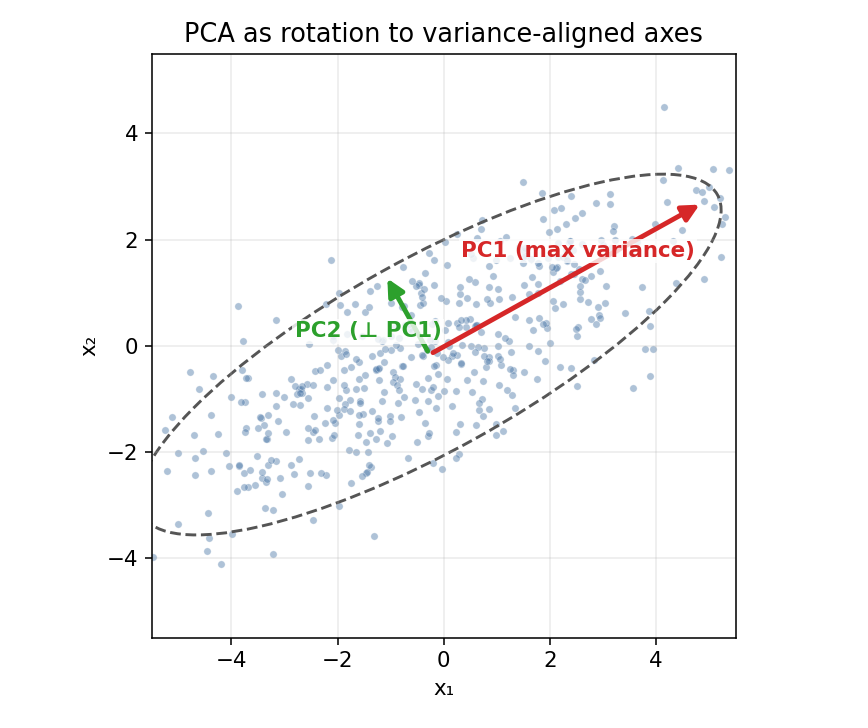
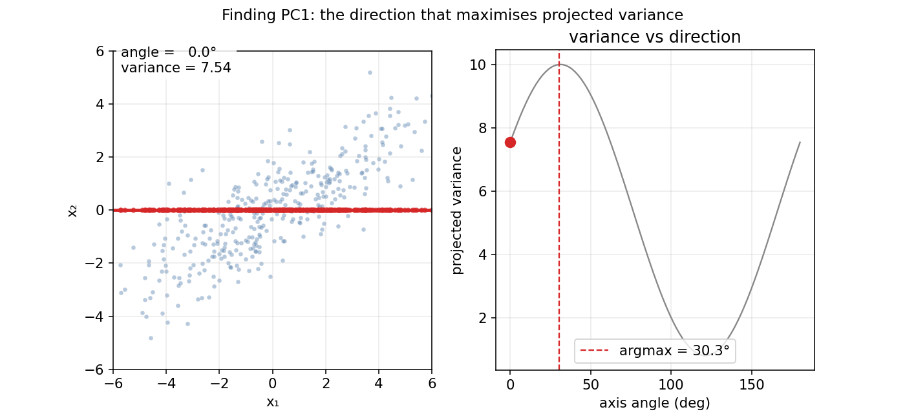
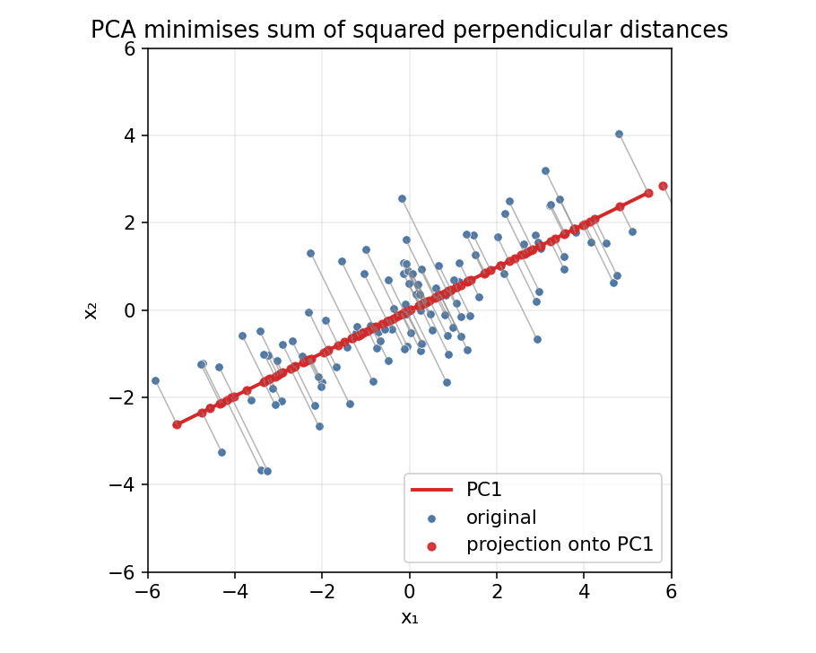
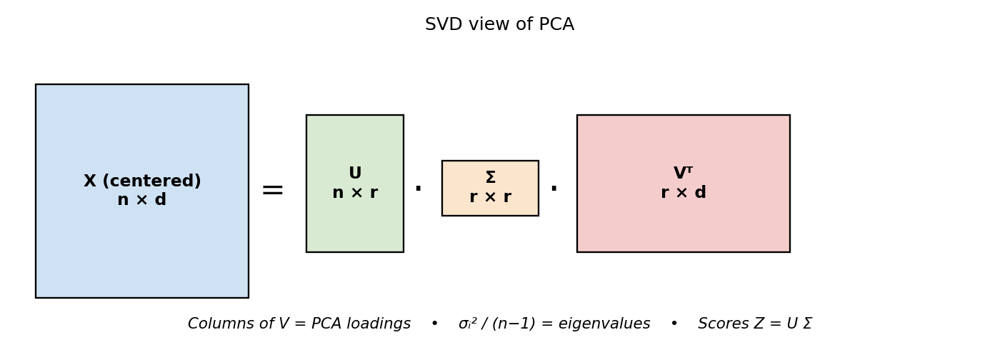
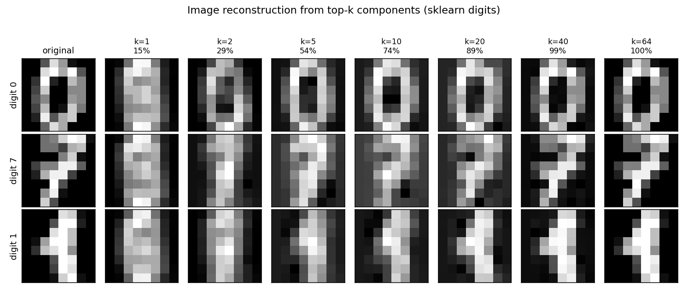
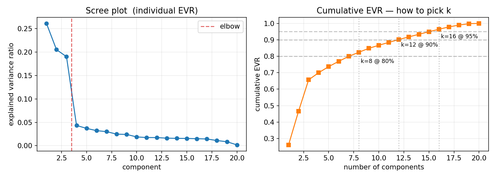
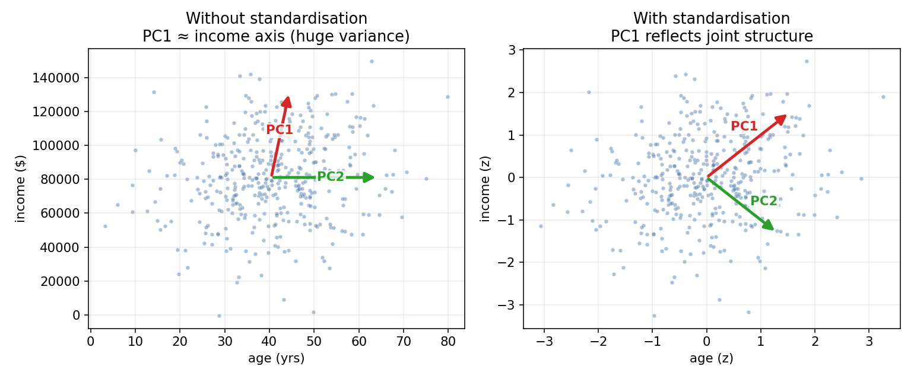
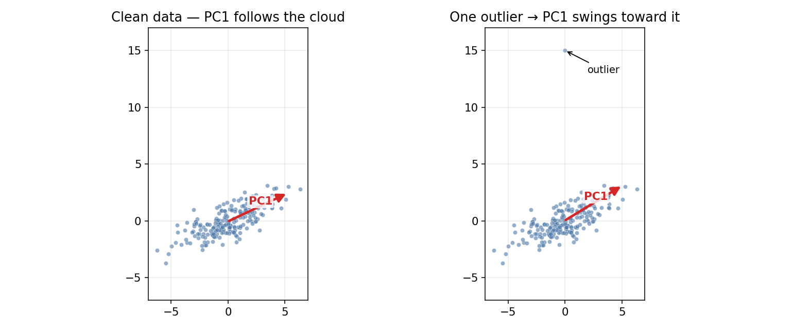
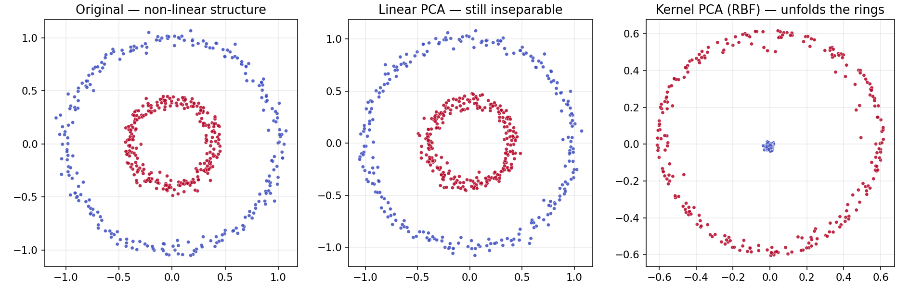
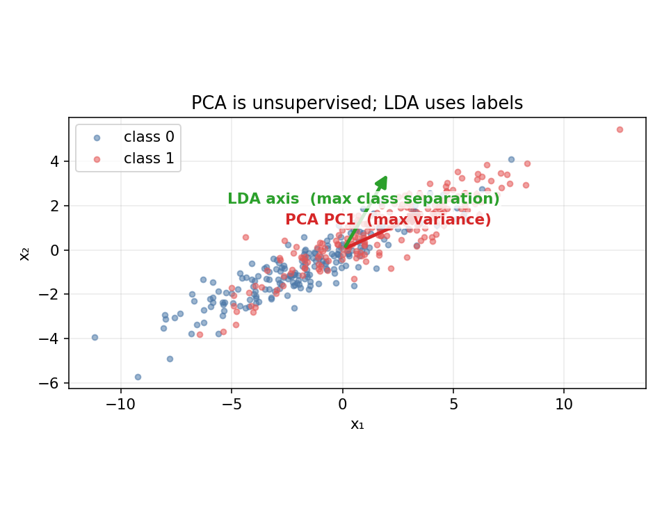

# PCA — A Practical Guide for ML Engineers

A concise, code-first reference. Focuses on **what to do, when to do it, and how to do it in scikit-learn** — not on derivations.

---

## Table of Contents

1. [What PCA Is (and Isn't)](#1-what-pca-is-and-isnt)
2. [Visual Intuition](#2-visual-intuition)
3. [The PCA Workflow in Code](#3-the-pca-workflow-in-code)
4. [Choosing the Number of Components](#4-choosing-the-number-of-components)
5. [When PCA Fails — and What to Do](#5-when-pca-fails--and-what-to-do)
6. [Variants of PCA](#6-variants-of-pca)
7. [PCA vs Other Dimensionality-Reduction Methods](#7-pca-vs-other-dimensionality-reduction-methods)
8. [Engineering Checklist](#8-engineering-checklist)
9. [Interview-Style Q&A (Practical)](#9-interview-style-qa-practical)
10. [Cheat-Sheet](#10-cheat-sheet)

---

## 1. What PCA Is (and Isn't)

**PCA** (Principal Component Analysis) is an **unsupervised, linear** transformation that re-expresses your data in a new coordinate system where the axes (principal components) are ordered by how much variance they capture.

**Use PCA for**
- **Dimensionality reduction** — keep the first *k* components.
- **Decorrelation** — the new features are uncorrelated.
- **Visualization** — project high-dimensional data to 2D / 3D.
- **Noise filtering** — low-variance directions are often noise.
- **Speeding up downstream models** — fewer features = faster training.

**PCA is NOT**
- A classifier or regressor (no labels in the objective).
- A feature-selection method (new features are combinations of originals).
- Scale-invariant — almost always standardize first.
- A way to pick "important" original features.

---

## 2. Visual Intuition

**PC1 is the direction of greatest spread. PC2 is perpendicular to it with the next-most spread.**



The algorithm's definition, animated: sweep a candidate axis around 180°, measure the variance of the points projected onto it, and keep the angle that maximises it.



Equivalently, PCA picks the line that **minimises the sum of squared perpendicular distances** from each point to the line. The grey segments below are those residuals.



**That is all the theory you need to remember.** Maximize variance ⇔ minimize reconstruction error. Everything else is engineering.

---

## 3. The PCA Workflow in Code

### Standard recipe (the 90 % use case)

```python
from sklearn.decomposition import PCA
from sklearn.preprocessing import StandardScaler
from sklearn.pipeline import Pipeline
from sklearn.model_selection import train_test_split

X_train, X_test, y_train, y_test = train_test_split(
    X, y, test_size=0.25, random_state=42, stratify=y
)

pipe = Pipeline([
    ("scaler", StandardScaler()),
    ("pca",    PCA(n_components=0.95, svd_solver="randomized",
                   random_state=42)),
])

X_train_pca = pipe.fit_transform(X_train)   # fit on train only
X_test_pca  = pipe.transform(X_test)        # reuse fitted transform

print("components kept :", pipe.named_steps["pca"].n_components_)
print("variance kept   :", pipe.named_steps["pca"].explained_variance_ratio_.sum())
```

Three things to notice:
1. **Split before fit.** Fitting PCA on `X_train + X_test` is leakage.
2. **`StandardScaler` first.** Otherwise the feature with the biggest numeric range dominates PC1.
3. **`n_components=0.95`** tells sklearn: *pick the smallest k that keeps 95 % of the variance.*

### SVD solver choice

Under the hood, `PCA` uses SVD. You rarely need to care about the math, but you do need to pick the solver:

| Solver | Use when |
|---|---|
| `"auto"` (default) | Most cases |
| `"full"` | Small data, want *all* components |
| `"randomized"` | **High-dim data** (d ≫ 100) — fast top-*k* approximation |
| `"arpack"` | Sparse inputs, few components |

For genomics / images / text embeddings, always prefer `"randomized"`.



### Inspecting the fitted PCA

```python
pca = pipe.named_steps["pca"]

pca.components_               # (k, d)  — loadings: rows are PC directions
pca.explained_variance_       # (k,)    — variance along each PC
pca.explained_variance_ratio_ # (k,)    — fraction of total variance
pca.mean_                     # (d,)    — per-feature mean (for un-centering)
pca.n_components_             # k actually chosen
```

### Reconstructing / inverse transform

```python
X_reconstructed = pipe.inverse_transform(X_train_pca)
# Shape-match: back to original d-dim space but rank k
```

Reconstruction is lossy; quality improves with more components:



---

## 4. Choosing the Number of Components

| Method | How | When |
|---|---|---|
| **Variance threshold** | `PCA(n_components=0.95)` — smallest *k* for ≥ 95 % variance | Default |
| **Scree / elbow** | Plot EVR vs component, pick the kink | Visual sanity check |
| **Cross-validation** | Treat *k* as a hyperparameter for your real task | When downstream accuracy matters |
| **Minka's MLE** | `PCA(n_components="mle")` | Lets a probabilistic model pick |

**Rule of thumb**
- Downstream model → **tune *k* with CV**.
- Visualization → use 2 or 3.
- Preprocessing at scale → 95 % variance threshold.

```python
import numpy as np, matplotlib.pyplot as plt

pca = PCA(n_components=50, svd_solver="randomized").fit(X_train_scaled)

evr  = pca.explained_variance_ratio_
cevr = np.cumsum(evr)

fig, ax = plt.subplots(1, 2, figsize=(11, 4))
ax[0].plot(range(1, len(evr)+1), evr, "o-");  ax[0].set_title("Scree")
ax[1].plot(range(1, len(cevr)+1), cevr, "s-"); ax[1].set_title("Cumulative EVR")
ax[1].axhline(0.95, ls="--", color="grey")
plt.show()
```



---

## 5. When PCA Fails — and What to Do

### 1. Features on different scales
Without standardization, high-variance features dominate. Compare: left is raw, right is standardized — PC1 direction changes completely.



**Fix:** `StandardScaler` before `PCA`.

### 2. Outliers
PCA uses variance, which is *quadratic* in deviations. A single extreme point can rotate PC1 toward it.



**Fixes:**
- Remove or winsorize outliers before fitting.
- Use `RobustScaler` instead of `StandardScaler`.
- Try `sklearn.decomposition.MiniBatchSparsePCA` or a dedicated Robust PCA.

### 3. Non-linear structure
Linear PCA can only rotate; it cannot unfold curved manifolds. Two concentric rings stay tangled under linear PCA; an RBF kernel unfolds them.



**Fix:**
```python
from sklearn.decomposition import KernelPCA
kpca = KernelPCA(n_components=2, kernel="rbf", gamma=15).fit_transform(X)
```
Or use t-SNE / UMAP / autoencoders for stronger non-linearity.

### 4. Categorical or sparse data
Variance isn't well-defined on categorical data, and centering destroys sparsity. Use:
- `TruncatedSVD` — works on sparse matrices without centering (a.k.a. LSA for text).
- MCA (Multiple Correspondence Analysis) for categorical.

### 5. You need interpretability
Components are dense linear combinations of all features — hard to explain. Use `SparsePCA` to get loadings that are zero for most features.

---

## 6. Variants of PCA

| Variant | sklearn class | When |
|---|---|---|
| Standard PCA | `PCA` | General use |
| Kernel PCA | `KernelPCA` | Non-linear structure |
| Sparse PCA | `SparsePCA`, `MiniBatchSparsePCA` | Interpretable loadings |
| Incremental PCA | `IncrementalPCA` | Data doesn't fit in memory |
| Truncated SVD | `TruncatedSVD` | Sparse / text data |
| Randomized PCA | `PCA(svd_solver="randomized")` | High-dim (d ≫ n) |

---

## 7. PCA vs Other Dimensionality-Reduction Methods

| Method | Linear? | Supervised? | Good for |
|---|---|---|---|
| **PCA** | Yes | No | General preprocessing, decorrelation |
| **LDA** | Yes | Yes | Classification preprocessing |
| **ICA** | Yes | No | Source separation (audio, EEG) |
| **NMF** | Yes (non-neg) | No | Topic modeling, parts-based |
| **t-SNE** | No | No | 2D/3D visualization only |
| **UMAP** | No | Optional | Visualization, sometimes features |
| **Autoencoders** | No | No | Learned non-linear compression |

**PCA vs LDA** — the most common interview comparison. PCA maximizes variance (ignores labels); LDA maximizes class separability (uses labels). Same data, different optimal axes:



```python
from sklearn.discriminant_analysis import LinearDiscriminantAnalysis
lda = LinearDiscriminantAnalysis(n_components=2).fit_transform(X, y)
```

**Key soundbite:** *PCA is the linear, unsupervised, variance-maximizing baseline. Everything else trades one of those properties for something the problem needs.*

---

## 8. Engineering Checklist

1. **Split train/test before fitting PCA.** Leakage is the #1 silent bug.
2. **Standardize when feature scales differ.** Skip only if scales are already comparable (pixels, log-TPM, etc.).
3. **Use `svd_solver="randomized"` for high-dim data.** Don't form the `d × d` covariance matrix when d ≫ n.
4. **Persist `pca.mean_`, `pca.components_`, `pca.explained_variance_ratio_`.** These *are* your model.
5. **Tune k with cross-validation** when a downstream model exists.
6. **Component signs are arbitrary.** Don't compare signs across library runs.
7. **PCA doesn't handle NaNs.** Impute first (`SimpleImputer`, `KNNImputer`, or use PPCA).
8. **Check `explained_variance_ratio_.sum()`** — report this number in any write-up.
9. **Loadings ≠ feature importance** for your target. They measure contribution to variance, not prediction.
10. **More components ≠ better downstream model.** Low-variance dims may be noise.

---

## 9. Interview-Style Q&A (Practical)

### Q1. Explain PCA in one sentence.
*PCA finds the directions along which the data varies the most, and projects the data onto the top-k of those directions to reduce dimensionality while keeping most of the information.*

### Q2. Why do you standardize before PCA?
Because PCA maximizes variance. If one feature has variance 10⁶ (e.g. income in dollars) and another variance 10 (age in years), PC1 will align with income regardless of whether income is more informative. Standardization puts every feature on equal footing.

### Q3. How do you choose k?
Four practical ways:
1. Variance threshold (`n_components=0.95`) — default.
2. Scree-plot elbow — quick visual.
3. Cross-validation on the downstream model — best when you have a target task.
4. `n_components="mle"` — probabilistic auto-select.

### Q4. Does PCA always improve a downstream model?
No. PCA discards low-variance directions, which can still be label-discriminative. If you have labels and a classification task, consider **LDA** or tune *k* via CV.

### Q5. When does PCA fail?
- Non-linear data → kernel PCA, t-SNE, UMAP, autoencoders.
- Outliers → RobustScaler or Robust PCA.
- Categorical data → TruncatedSVD (for sparse) or MCA.
- Class-discriminative signal in low-variance directions → use a supervised method.

### Q6. You have 100 samples and 20 000 features. How do you run PCA?
Use `PCA(svd_solver="randomized", n_components=50)`. Never form the `20000 × 20000` covariance matrix. Randomized SVD computes top-*k* components in `O(n·d·k)`.

### Q7. Can PCA be used for feature selection?
Not directly — each PC is a linear combination of *all* features. You can inspect loadings to see which originals dominate each PC, or use `SparsePCA` for interpretable per-PC sparsity.

### Q8. How many components can you get from (n, d) data?
At most `min(n - 1, d)` non-zero components. The `n - 1` comes from centering.

### Q9. Is PCA sensitive to outliers?
Yes, very. Variance is quadratic in deviations, so one extreme point can swing PC1. Clean the data or switch to Robust PCA.

### Q10. What's the relation between PCA and SVD?
sklearn's `PCA` runs SVD on the centered data matrix internally. You don't need to implement it yourself.

### Q11. Can PCA be applied to sparse data?
Not directly (centering destroys sparsity). Use `TruncatedSVD` — same math, no centering.

### Q12. If two runs of PCA give flipped signs, is something wrong?
No. Eigenvectors are defined up to sign. Compare subspaces / reconstructions, not individual component signs.

### Q13. What does `explained_variance_ratio_` tell you?
The fraction of total variance each component captures. Summing the first *k* gives you the "information retained" headline number.

### Q14. How do you inverse-transform a PCA-reduced sample?
```python
X_recon = pca.inverse_transform(X_pca)   # lossy, rank-k
```

### Q15. Does PCA require the data to be Gaussian?
No. It makes no distributional assumption. Gaussian data is where PCA is *optimal* in a maximum-likelihood sense, but PCA works on any numeric data.

---

## 10. Cheat-Sheet

```
OBJECTIVE     maximise variance  ⇔  minimise reconstruction error

RECIPE        split → scale → PCA → downstream model
              pipe = Pipeline([("scaler", StandardScaler()),
                               ("pca", PCA(n_components=0.95,
                                           svd_solver="randomized"))])

OUTPUTS       components_ (k, d)        — PC directions (loadings)
              explained_variance_ratio_ — fraction of variance per PC
              mean_                     — for centering new data

CHOOSE k      variance threshold | elbow | CV | "mle"

SENSITIVE     scale, outliers, non-linearity
NOT SENSITIVE labels, normality, monotone transforms of y

HIGH-DIM      PCA(svd_solver="randomized")
SPARSE        TruncatedSVD
NON-LINEAR    KernelPCA, t-SNE, UMAP
INTERPRETABLE SparsePCA
OUT-OF-CORE   IncrementalPCA
```

---

**Pair this guide with [`Gene_Expression_PCA.ipynb`](Gene_Expression_PCA.ipynb) to see every step applied to a real high-dimensional biological dataset.**
